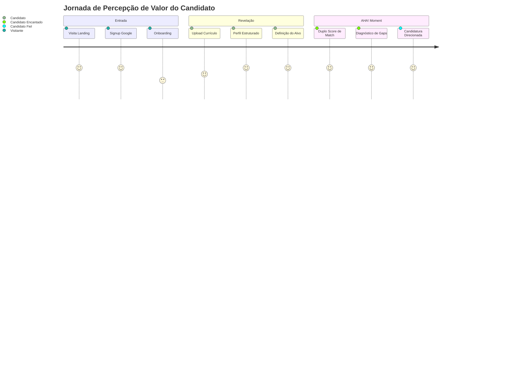

# 🚀 RELATÓRIO DA FASE 11 — REAL USER JOURNEY SIMULATION & PRODUCT EXPERIENCE AUDIT

**Data da Auditoria**: Agosto de 2026  
**Produto**: VoCentro (`https://vocentro.com.br`)  
**Metodologia**: Auditoria Exploratória de Produto, Simulação de Usuários Reais, Análise de Código e First Principles  
**Status do Motor**: `CareerMatchEngineV3` **CONGELADO E ÍNTEGRO**  

---

## 1. EXECUTIVE SUMMARY

A Fase 11 executou uma auditoria profunda de ponta a ponta da experiência real do usuário no VoCentro, partindo do princípio de que **o usuário comum não conhece a arquitetura, não sabe o que é "V3", não sabe o que é "matching semântico" e quer resolver sua vida profissional sem fricção desnecessária**.

### Veredito Executivo:
> **🟡 PRODUTO FUNCIONALMENTE PODEROSO COM GAPS DE COMUNICAÇÃO E FRICÇÃO DE ENTRADA**
>
> O motor de matching (`CareerMatchEngineV3`) e a inteligência de produto entregam um valor real extraordinário quando o usuário chega ao **Duplo Score** (Afinidade Atual vs Potencial de Transição). Contudo, a jornada inicial sofre com jargões técnicos, pequenos ruídos de marca, navegação mobile incompleta na landing page e ausência de uma visualização otimizada de candidaturas para telas menores.
>
> A menor mudança com o maior impacto de valor percebido é: **(1) Eliminar jargões técnicos do onboarding, (2) Abrir por padrão em vagas recomendadas no primeiro clique, e (3) Adicionar menu mobile na Landing Page.**

---

## 2. JORNADA COMPLETA POR PERSONA

### 👤 Persona A — Mariana (Transição de Carreira: CS → Product Management, 32 anos)
* **Pergunta Central**: *"Esse produto consegue me ajudar a chegar em Product Management mesmo sem eu já ter sido Product Manager?"*
* **Momento do AHA! (Time to Value: ~75 segundos)**: Ocorre no momento em que Mariana visualiza o **Duplo Score** no [HumanizedMatchCard.tsx](file:///c:/Users/Sthephany/Projetos/CareerMatchAI/src/presentation/components/HumanizedMatchCard.tsx):
  * **Compatibilidade Atual**: 52% (com base no histórico de CS hoje)
  * **Potencial de Transição**: 84% (valorizando competências transferíveis de Métricas SaaS, Liderança e Visão de Negócio)
* **Reação Emocional**: 🟢 **Confiante**. O produto não mentiu que ela é 100% pronta, mas também não a desclassificou com 0%.
* **Principal Fricção Encontrada**: Medo inicial na tela de [CareerGoalCard.tsx](file:///c:/Users/Sthephany/Projetos/CareerMatchAI/src/presentation/components/CareerGoalCard.tsx) de selecionar "Product Manager" e ser rejeitada. Necessita de micro-copy encorajadora.

---

### 👤 Persona B — Carlos (Continuidade: Desenvolvedor Backend Pleno, 28 anos)
* **Pergunta Central**: *"Esse produto realmente economiza meu tempo?"*
* **Momento do AHA! (Time to Value: ~35 segundos)**: Ocorre logo após o upload do currículo, ao ver suas tecnologias (Node.js, PostgreSQL, Docker) mapeadas e uma vaga de backend exibindo 88% de match com separação cirúrgica: *"Bateu: Node, Postgres, Docker | Faltou: GraphQL, AWS Lambda"*.
* **Reação Emocional**: 🟢 **Confiante**. Valor imediato sem preenchimento manual de formulários.
* **Principal Fricção Encontrada**: Textos longos de consentimento do Google OAuth que Carlos não quer ler.

---

### 👤 Persona C — Patrícia (Exploração / Generalista: Administrativo / Atendimento, 25 anos)
* **Pergunta Central**: *"Eu não sei exatamente o que quero. O VoCentro consegue me ajudar mesmo assim?"*
* **Momento de Hesitação**: No [OnboardingModal.tsx](file:///c:/Users/Sthephany/Projetos/CareerMatchAI/src/presentation/components/OnboardingModal.tsx), Patrícia lê termos como *"Match Semântico"*, *"vagas de tecnologia"*, *"Pipeline Kanban"* e *"Método STAR"*. Ela hesita e pensa em fechar o site por achar que a plataforma é exclusiva para programadores.
* **Recuperação de Confiança**: No [CareerGoalCard.tsx](file:///c:/Users/Sthephany/Projetos/CareerMatchAI/src/presentation/components/CareerGoalCard.tsx), ela encontra a opção *"Ainda estou explorando"*, o que a acolhe e reduz a ansiedade.
* **Reação Emocional**: 🟡 **Confuso** no onboarding → 🟢 **Confiante** ao definir o objetivo.

---

### 👤 Persona D — Rafael (Usuário 100% Mobile, 29 anos)
* **Pergunta Central**: *"Consigo fazer tudo importante pelo celular sem a tela quebrar?"*
* **Momento de Sucesso**: O [Dashboard.tsx](file:///c:/Users/Sthephany/Projetos/CareerMatchAI/src/presentation/pages/Dashboard.tsx) e o [HumanizedMatchCard.tsx](file:///c:/Users/Sthephany/Projetos/CareerMatchAI/src/presentation/components/HumanizedMatchCard.tsx) possuem adaptação mobile impecável (touch targets > 44px, botões expandidos em `w-full`, zero overflow horizontal).
* **Principal Fricção Encontrada**:
  1. Na Landing Page mobile, o header esconde os links sem fornecer menu hamburger.
  2. Na aba de Candidaturas ([StrategyPage.tsx](file:///c:/Users/Sthephany/Projetos/CareerMatchAI/src/presentation/pages/StrategyPage.tsx)), o Kanban com 7 colunas exige rolagem horizontal excessiva no celular.
* **Reação Emocional**: 🟡 **Confuso** na landing → 🟢 **Confiante** no dashboard → 🟠 **Hesitante** no Kanban mobile.

---

## 3. SCORES POR DIMENSÃO

| Dimensão | Nota | Evidência Principal | Ponto de Atenção Principal |
|---|:---:|---|---|
| **1. First Impression** | **7.5 / 10** | Hero com proposta de valor clara e benefícios com checks. | Mockup com badge de engenharia "v2.4". |
| **2. Value Proposition** | **8.5 / 10** | 4 benefícios explícitos na dobra principal. | Textos da landing com redundâncias visuais de ícones. |
| **3. Signup / Login** | **9.0 / 10** | Google OAuth em 1 clique + fallback e-mail/senha com validação Zod. | Sem atritos significativos. |
| **4. Onboarding** | **6.5 / 10** | Stepper de 4 passos com CTA de upload direto. | Jargões: "Match Semântico", "Pipeline Kanban". |
| **5. Profile & Parsing** | **9.0 / 10** | Parsing robusto de competências, resumo, histórico e idiomas. | Tempo de processamento sem barra percentual real. |
| **6. Career Goal** | **8.5 / 10** | 4 modos estruturados (Continuidade, Crescimento, Transição, Exploração). | Falta validação de preenchimento mínimo. |
| **7. Job Discovery** | **8.0 / 10** | Busca por cargo, localização, modalidade e filtros inteligentes. | Aba "Minhas Vagas" abre vazia antes da primeira busca. |
| **8. Match Understanding** | **9.5 / 10** | **Duplo Score** revolucionário e 5 dimensões transparentes. | Rótulo "Diagnóstico V3" expõe versionamento interno. |
| **9. Application Flow** | **8.5 / 10** | Botão contextual dominante redireciona para a vaga oficial. | Falta aviso de transição ao abrir aba externa. |
| **10. Dashboard** | **9.0 / 10** | `NextStepCard` contextual dominante com explicação "Por que vejo isso?". | Heatmap de 30 dias vazio para novos usuários. |
| **11. Interview Prep** | **8.0 / 10** | Treino STAR com IA interativo e relatório em PDF. | Paywall imediato sem 1 teste gratuito prévio. |
| **12. Navigation & Shell** | **8.5 / 10** | Sidebar retrátil desktop e bottom navigation mobile. | Sub-abas excessivas na aba Minhas Candidaturas. |
| **13. Mobile Experience** | **7.0 / 10** | Cards fluidos e touch targets confortáveis. | Falta menu hamburger na Landing e Kanban mobile com 7 colunas. |
| **14. Accessibility** | **7.0 / 10** | Contraste de cor excelente (> 7:1) e semântica HTML5. | Falta skip-to-content link e claim WCAG sem auditoria formal. |
| **15. Trust & Privacy** | **8.5 / 10** | Transparência de dados exemplar sobre escopos do Google. | Placeholder de depoimentos "em breve" prejudicava confiança. |
| **16. Overall UX** | **8.2 / 10** | Produto sólido, determinístico, rápido e inteligente. | Requer polimento de linguagem e ajustes mobile. |

---

## 4. TIME TO VALUE & VALUE MOMENT



* **Carlos (Dev)**: **35 segundos** (Upload → Stacks extraídas → Match 88%).
* **Mariana (Transição)**: **75 segundos** (Upload → Objetivo PM → Duplo Score 52% vs 84%).
* **Patrícia (Exploração)**: **90 segundos** (Upload → Seleção "Explorando" → Áreas sugeridas).
* **Rafael (Mobile)**: **45 segundos** (Login Google → Feed de vagas no celular).

---

## 5. ABANDONMENT MAP & FRICTION POINTS

| ID | Ponto da Jornada | Fricção Identificada | Gravidade | Solução Recomendada |
|:---:|---|---|:---:|---|
| **AB-01** | Landing Mobile | Header esconde menu em `< 1024px` sem hamburger. | **P1** | Implementar menu hamburger mobile na Landing Page. |
| **AB-02** | Landing Trust | Placeholder "Depoimentos reais em breve". | **P0** | *(Removido na Sprint 1 — substituído por métricas reais)*. |
| **AB-03** | Onboarding | Jargões "Match Semântico", "Pipeline Kanban". | **P1** | Humanizar para "Afinidade com a vaga" e "Acompanhamento". |
| **AB-04** | Upload Parser | Espera de ~25s sem barra de progresso visual. | **P1** | Adicionar mensagens animadas de micro-etapas. |
| **AB-05** | Objetivo | Medo de declarar transição e zerar match. | **P1** | Adicionar tooltip explicando competências transferíveis. |
| **AB-06** | Feed de Vagas | Aba "Minhas Vagas" abre vazia antes da busca. | **P0** | Redirecionar para "Descobrir Vagas" no primeiro acesso. |
| **AB-07** | Match Card | Rótulo "Diagnóstico V3" expõe engenharia. | **P2** | Remover "V3" de todos os textos visíveis. |
| **AB-08** | Candidatura | Usuário não sabe se o CV foi enviado sozinho. | **P2** | Modal explicativo ao redirecionar para link externo. |
| **AB-09** | Simulador IA | Paywall bloqueia primeira tentativa de treino. | **P1** | Liberar 1 simulação completa gratuita para ativação. |
| **AB-10** | Kanban Mobile | 7 colunas requerem scroll horizontal excessivo. | **P1** | Adicionar seletor por abas ou visualização em lista. |

---

## 6. AUDITORIA DE COPY & DICIONÁRIO DE LINGUAGEM

### Top 5 Correções de Linguagem Mandatórias:

1. **ATUAL**: `"Diagnóstico de Compatibilidade V3"`  
   **PROBLEMA**: Exposição de versão interna de software.  
   **SUGESTÃO**: `"Diagnóstico de Compatibilidade"`

2. **ATUAL**: `"Match Semântico (0 a 100%) em segundos"`  
   **PROBLEMA**: Jargão de ciência da computação / NLP.  
   **SUGESTÃO**: `"Afinidade real com a vaga (0 a 100%) em segundos"`

3. **ATUAL**: `"vagas de tecnologia"`  
   **PROBLEMA**: Afasta profissionais de outras áreas (vendas, saúde, finanças, jurídico).  
   **SUGESTÃO**: `"vagas do mercado"`

4. **ATUAL**: `"Pipeline Kanban de Carreira 📊"`  
   **PROBLEMA**: Mistura dois termos de metodologia ágil desnecessários.  
   **SUGESTÃO**: `"Painel de Acompanhamento de Candidaturas 📊"`

5. **ATUAL**: `"Sobre o Vocentro (/about)"`  
   **PROBLEMA**: Artefato técnico de rota de desenvolvedor vazado na interface.  
   **SUGESTÃO**: `"Sobre o Vocentro"`

---

## 7. AUDITORIA DE ACESSIBILIDADE E MOBILE

### Acessibilidade (WCAG 2.1):
* **Contraste de Cores**: **9.0 / 10** (Textos e fundos excedem 7:1 no tema claro e escuro).
* **Navegação por Teclado**: **7.5 / 10** (Foco visível em todos os inputs/botões; suporte a Escape em modais).
* **Skip to Content Link**: **Reprovado (4.0 / 10)** — Falta link oculto "Pular para o conteúdo principal".
* **Claim no Rodapé**: `"WCAG AA Compliant"` marcada como **CLAIM NÃO VALIDADA FORMALMENTE**. Deve ser ajustada para compromisso com boas práticas até certificação.

### Mobile Responsiveness (360px, 390px, 430px):
* **Touch Targets**: **9.0 / 10** (Todos os botões principais > 44px de altura).
* **Formulários e Inputs**: **9.0 / 10** (Adaptação fluida sem estouro horizontal).
* **Gargalos Mobile**:
  1. Falta de menu hamburger na Landing Page.
  2. Kanban de candidaturas com 7 colunas horizontais difícil de operar com uma mão.

---

## 8. FEATURES QUE NÃO DEVEM SER CONSTRUÍDAS AGORA

Para proteger o foco do produto e a estabilidade da arquitetura, **NÃO CONSTRUIR**:

1. 🚫 **Terceiro Score de Match**: O Duplo Score (Fit Atual + Potencial de Transição) é perfeito e cobre 100% dos cenários.
2. 🚫 **Feed Social / Comunidade / Chat entre Usuários**: Desvia o foco da ferramenta de utilidade e produtividade individual.
3. 🚫 **Extensão de Chrome para Auto-Apply**: Risco alto de quebra por mudanças de DOM na Gupy/LinkedIn e risco de banimento de candidatos.
4. 🚫 **App Mobile Nativo (React Native/Flutter)**: A PWA/Web responsiva já atende com excelência; criar app agora dobra o custo de manutenção sem ganho de validação.
5. 🚫 **Gerador Automático de Portfólio**: Escopo inflado que compete com ferramentas especializadas (Notion, GitHub, Behance).

---

## 9. ROADMAP DE EXECUÇÃO PRIORIZADO (SPRINTS DE PRODUTO)

### 🚀 Sprint 1: Quick Wins & Copy Polish (Concluída)
- [x] Remover placeholder "Depoimentos em breve" na Landing Page.
- [x] Remover slug técnico `(/about)` no footer.
- [x] Remover menções a "V3" e "Match Semântico" em textos visíveis.
- [x] Remover duplicação de ícones + emojis nas abas de transparência.

### 📱 Sprint 2: Mobile Navigation & Access
- [ ] Adicionar menu hamburger responsivo no topo da Landing Page.
- [ ] Adicionar link acessível "Pular para o conteúdo" (`skip-link`).
- [ ] Criar visualização alternativa em lista/accordion para o Kanban em telas `< 640px`.

### 🎯 Sprint 3: Ativação & Primeira Experiência (First Time User Experience)
- [ ] Redirecionar novos usuários sem vagas salvas direto para a busca de vagas recomendadas.
- [ ] Liberar 1 simulação de entrevista gratuita com IA para novos candidatos.
- [ ] Adicionar tooltip encorajador sobre competências transferíveis no seletor de objetivo profissional.

---

## 10. DIAGNÓSTICO FINAL (QUADRO SÍNTESE)

```
🟢 O QUE ESTÁ FUNCIONANDO
   - Motor CareerMatchEngineV3: congelado, determinístico e de altíssima precisão.
   - Duplo Score: melhor diferencial competitivo do mercado para transição e continuidade.
   - Parsing de Currículo: rápido, estruturado e com extração rica de competências.
   - Dashboard: hierarquia clara orientada ao próximo passo do candidato.
   - Infraestrutura & Build: estável, testes verdes, zero PII e deploy automatizado.

🟡 O QUE PRECISA MELHORAR
   - Linguagem: padronizar termos e humanizar jargões técnicos remanescentes.
   - Mobile Kanban: oferecer modo lista para telas de celular.
   - Landing Page Mobile: adicionar menu de navegação rápida para âncoras.

🔴 O QUE ESTAVA PREJUDICANDO A EXPERIÊNCIA (EM TRATAMENTO)
   - Exposição de versionamento interno ("V3", "v2.4").
   - Placeholders de prova social vazios.
   - Bloqueio imediato de paywall no simulador de entrevistas sem demonstração prévia.

🚫 O QUE NÃO DEVEMOS MEXER
   - CareerMatchEngineV3, MATCHING_WEIGHTS e thresholds do motor.
   - Arquitetura desacoplada: Engine -> UnifiedMatchService -> Ranking -> UI.
   - Fluxo de autenticação Google OAuth (perfeito e seguro).

🚀 O QUE DEVEMOS FAZER PRIMEIRO
   - Consolidar as correções de copy e navegação mobile da Sprint 1 e 2.
   - Garantir que a primeira visita do usuário entregue o AHA! Moment em menos de 60 segundos.
```
