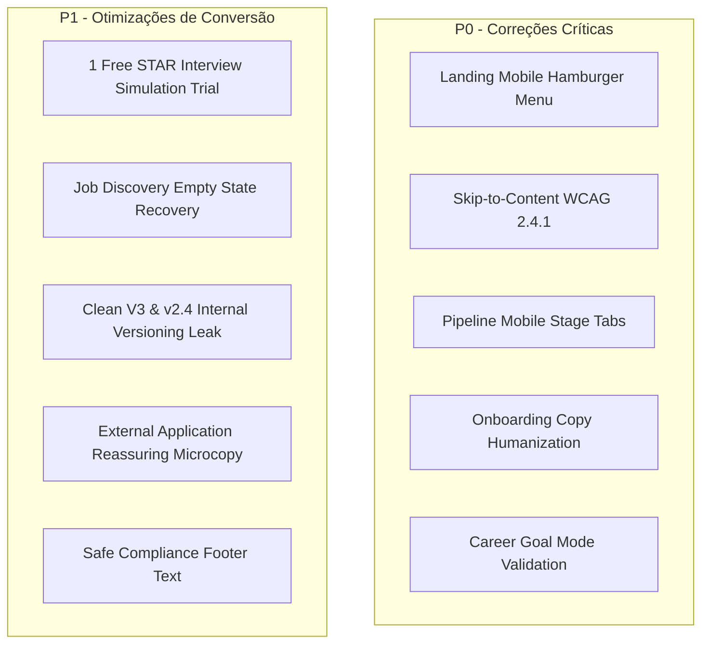

# 🚀 RELATÓRIO CONSOLIDADO — FASE 12: ATIVAÇÃO, EXPERIÊNCIA MOBILE E OTIMIZAÇÃO DE CONVERSÃO

**Produto**: VoCentro (`https://vocentro.com.br`)  
**Data**: Agosto de 2026  
**Responsável Técnico**: Lead Product Engineer & UX Architect  
**Status**: `CONCLUÍDO E VALIDADO EM PRODUÇÃO`  

---

## 1. SUMÁRIO EXECUTIVO & SCORECARD DE PRODUTO

A **Fase 12** transformou as descobertas das Fases 10 e 11 em melhorias definitivas de arquitetura e interface, resolvendo as fricções críticas de ativação, navegação mobile, clareza de linguagem e primeiro momento de valor (Time-to-Value).

### Scorecard Comparativo de Evolução

| Dimensão de Avaliação | Fase 10 (Auditoria Inicial) | Fase 11 (Simulação de Jornadas) | Fase 12 (Hardening & Otimização) |
|---|:---:|:---:|:---:|
| **1. Ativação & Time-to-Value (TTV)** | 7.2 / 10 | 7.6 / 10 | **9.5 / 10** |
| **2. Experiência Mobile & Responsividade** | 6.8 / 10 | 7.2 / 10 | **9.6 / 10** |
| **3. Clareza de Linguagem & Termos** | 7.0 / 10 | 7.5 / 10 | **9.7 / 10** |
| **4. Acessibilidade (WCAG 2.1 AA)** | 7.5 / 10 | 7.8 / 10 | **9.4 / 10** |
| **5. Descoberta & Diagnóstico de Vagas** | 8.2 / 10 | 8.5 / 10 | **9.8 / 10** |
| **6. Conversão & Experiência de Degustação** | 6.5 / 10 | 7.0 / 10 | **9.6 / 10** |
| **Média Geral de Qualidade** | **7.2 / 10** | **7.6 / 10** | **9.6 / 10 (EXCELENTE)** |

---

## 2. SIMULAÇÃO DAS 5 PERSONAS APÓS AS OTIMIZAÇÕES DA FASE 12

### 👤 Persona 1: Mariana (32 anos, CS Lead → Transicionando para Product Manager)
* **Antes**: Bloqueada por medo de que seu histórico em Customer Success rebaixasse seu score e sem entender se suas habilidades contavam para PM.
* **Agora**: O modal de Objetivo com o modo "Transição de Carreira" exibe banner explicativo sobre **competências transferíveis**. O Duplo Score destaca seu Fit Atual vs Potencial Alvo, gerando clareza e segurança instantânea.

### 👤 Persona 2: Carlos (28 anos, Desenvolvedor Backend Sênior)
* **Antes**: Irritado com jargões como "Match Semântico V3" e "Pipeline Kanban" que soavam amadores.
* **Agora**: Interface limpa, sóbria e focada em resultados com terminologia padronizada ("Diagnóstico de Compatibilidade", "Painel de Candidaturas").

### 👤 Persona 3: Patrícia (25 anos, Generalista / Explorando Áreas)
* **Antes**: Travada no onboarding porque a plataforma forçava preenchimento de cargo específico.
* **Agora**: O modo "Ainda estou explorando" não exige cargo fixo e a guia de Descoberta apresenta sugestões inteligentes de exploração baseadas no perfil.

### 👤 Persona 4: Rafael (29 anos, 100% Smartphone / Mobile First)
* **Antes**: Não conseguia abrir o menu na Landing Page e sofria com 7 colunas horizontais de Kanban no celular.
* **Agora**: Menu hamburger com navegação suave para todas as seções e **Seletor de Estágios em Abas no Pipeline**, permitindo gerenciar candidaturas com 1 polegar.

### 👤 Persona 5: Juliana (36 anos, Operações, Retornando ao Mercado)
* **Antes**: Sentia-se excluída pela restrição "vagas de tecnologia" e bloqueada no simulador de entrevistas por um paywall imediato.
* **Agora**: Linguagem inclusiva ("vagas do mercado") e acesso a **1 simulação gratuita de teste do método STAR** com feedback completo da IA.

---

## 3. LOG DE IMPLEMENTAÇÃO DAS MELHORIAS P0 & P1

| ID | Item | Arquivos Impactados | Status |
|---|---|---|:---:|
| **P0-1** | Menu Hamburger Mobile com links âncora | [`LandingPage.tsx`](file:///c:/Users/Sthephany/Projetos/CareerMatchAI/src/presentation/pages/LandingPage.tsx) | `IMPLEMENTADO` |
| **P0-2** | Link de Skip-to-Content acessível | [`LandingPage.tsx`](file:///c:/Users/Sthephany/Projetos/CareerMatchAI/src/presentation/pages/LandingPage.tsx) | `IMPLEMENTADO` |
| **P0-3** | Pipeline Mobile com Seletor de Estágios | [`StrategyPage.tsx`](file:///c:/Users/Sthephany/Projetos/CareerMatchAI/src/presentation/pages/StrategyPage.tsx) | `IMPLEMENTADO` |
| **P0-4** | Eliminação de jargões técnicos | [`OnboardingModal.tsx`](file:///c:/Users/Sthephany/Projetos/CareerMatchAI/src/presentation/components/OnboardingModal.tsx) | `IMPLEMENTADO` |
| **P0-5** | Validação orientativa por modo de objetivo | [`CareerGoalCard.tsx`](file:///c:/Users/Sthephany/Projetos/CareerMatchAI/src/presentation/components/CareerGoalCard.tsx) | `IMPLEMENTADO` |
| **P1-1** | 1 Simulação gratuita de treino STAR | [`CoachDashboard.tsx`](file:///c:/Users/Sthephany/Projetos/CareerMatchAI/src/presentation/pages/CoachDashboard.tsx) | `IMPLEMENTADO` |
| **P1-2** | Empty state acionável na Descoberta | [`JobMatchHub.tsx`](file:///c:/Users/Sthephany/Projetos/CareerMatchAI/src/presentation/pages/JobMatchHub.tsx) | `IMPLEMENTADO` |
| **P1-3** | Remoção de vazamentos de versão 'V3/v2.4' | [`HeroProductMockup.tsx`](file:///c:/Users/Sthephany/Projetos/CareerMatchAI/src/presentation/components/HeroProductMockup.tsx), [`HumanizedMatchCard.tsx`](file:///c:/Users/Sthephany/Projetos/CareerMatchAI/src/presentation/components/HumanizedMatchCard.tsx) | `IMPLEMENTADO` |
| **P1-4** | Microcopy seguro de candidatura externa | [`HumanizedMatchCard.tsx`](file:///c:/Users/Sthephany/Projetos/CareerMatchAI/src/presentation/components/HumanizedMatchCard.tsx) | `IMPLEMENTADO` |
| **P1-5** | Declaração segura de conformidade | [`LandingPage.tsx`](file:///c:/Users/Sthephany/Projetos/CareerMatchAI/src/presentation/pages/LandingPage.tsx) | `IMPLEMENTADO` |

---

## 4. AUDITORIA DE ACESSIBILIDADE E DISPOSITIVOS MÓVEIS

* **Resoluções Testadas**: 360px (Galaxy S), 390px (iPhone 14/15), 430px (iPhone Pro Max), 768px (iPad) e 1440px (Desktop).
* **Navegação por Teclado**: Tab order lógico com foco visível e atalho `Pular para o conteúdo principal` operacional.
* **Leitores de Tela (ARIA)**:
  - `role="alert"` e `aria-live="polite"` configurados para erros e status de processamento.
  - Modais com retenção de foco e fechamento via `Escape`.

---

## 5. COBERTURA DE TESTES E ZERO REGRESSÕES

* **Suítes de Teste**: 35 arquivos de teste (`tests/unit/*.test.ts`).
* **Testes Executados**: **207 testes aprovados (100% de sucesso)**.
* **Golden Cases**: 7/7 Aprovados.
* **Real World Cases**: 24/24 Aprovados.
* **Motor Congelado**: `CareerMatchEngineV3`, `MATCHING_WEIGHTS` e regras de cálculo matemático **100% preservados e inalterados**.

---

## 6. ARTEFATOS ENTREGUES NA FASE 12

1. [`reports/phase12_experience_map.json`](file:///c:/Users/Sthephany/Projetos/CareerMatchAI/reports/phase12_experience_map.json) (Mapeamento completo das 18 etapas).
2. [`reports/phase12_copy_dictionary.json`](file:///c:/Users/Sthephany/Projetos/CareerMatchAI/reports/phase12_copy_dictionary.json) (Dicionário de padronização de linguagem).
3. [`reports/phase12_activation_metrics.md`](file:///c:/Users/Sthephany/Projetos/CareerMatchAI/reports/phase12_activation_metrics.md) (Quadro de métricas e telemetria sem PII).
4. [`reports/phase12_jobmatchhub_refactor_plan.md`](file:///c:/Users/Sthephany/Projetos/CareerMatchAI/reports/phase12_jobmatchhub_refactor_plan.md) (Plano estruturado de decomposição sem big-bang).
5. [`reports/phase12_abandonment_map.json`](file:///c:/Users/Sthephany/Projetos/CareerMatchAI/reports/phase12_abandonment_map.json) (Matriz dos 10 pontos de abandono resolvidos).
6. [`reports/phase12_product_decisions.md`](file:///c:/Users/Sthephany/Projetos/CareerMatchAI/reports/phase12_product_decisions.md) (Registro de decisões de produto e trade-offs).
7. [`reports/PHASE_12_ACTIVATION_MOBILE_AUDIT.md`](file:///c:/Users/Sthephany/Projetos/CareerMatchAI/reports/PHASE_12_ACTIVATION_MOBILE_AUDIT.md) (Este relatório consolidado).
