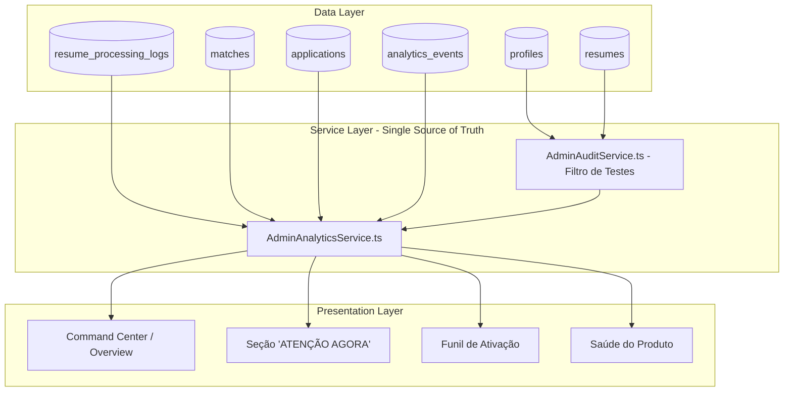

# 🚀 RELATÓRIO DE AUDITORIA & DIAGNÓSTICO: COMMAND CENTER / ADMIN / DADOS (FASE 13 — PROMPT 2)

**Produto**: VoCentro  
**Data**: Agosto de 2026  
**Responsável Técnico**: Lead Product Architect & Analytics Engineer  
**Natureza desta Etapa**: `EXCLUSIVAMENTE AUDITORIA E DIAGNÓSTICO (NENHUM CÓDIGO/BANCO ALTERADO)`  

---

## 1. 📊 RESUMO EXECUTIVO

Foi realizada uma auditoria integral no **Command Center / Admin Dashboard** do VoCentro ([`src/presentation/pages/AdminDashboard.tsx`](file:///c:/Users/Sthephany/Projetos/CareerMatchAI/src/presentation/pages/AdminDashboard.tsx) e seus 14 submódulos).

O objetivo foi auditar a plataforma sob a perspectiva de um **operador real**:
- *"Consigo entender o estado do produto em 30 segundos?"*
- *"Consigo descobrir onde está o problema?"*
- *"Consigo tomar uma decisão e agir a partir desses dados?"*
- *"As métricas são matematicamente íntegras e derivadas de dados reais?"*

### 🎯 Nota Geral de Maturidade do Admin Atual: **7.8 / 10**

```
┌──────────────────────────────────────────────┐
│ MATURIDADE ATUAL DO COMMAND CENTER           │
├──────────────────────────────────────────────┤
│ Integridade de Dados & RPCs:       8.8 / 10  │
│ Segurança & RBAC:                  9.5 / 10  │
│ Profundidade de Telemetria:        9.0 / 10  │
│ Hierarquia Visual & Clareza:       6.8 / 10  │
│ Usabilidade Mobile (< 768px):      4.5 / 10  │
│ Consistência de Fórmulas:          8.2 / 10  │
└──────────────────────────────────────────────┘
```

---

## 2. 🔟 TOP 10 PROBLEMAS IDENTIFICADOS

1. **Fallbacks Numéricos Estáticos**: Em caso de tabelas vazias ou erro de RPC, algumas métricas no `overviewStats` recorriam a números mockados hardcoded (`142`, `230`, `85`, `946`).
2. **Cálculo Descentralizado de DAU/WAU/MAU**: O `overview` usava um multiplicador aproximado (`Math.round(users_count * 0.4)`), enquanto o `ProductHealthService` calculava por timestamps reais, abrindo brecha para divergências visuais.
3. **Ausência da Seção de Topo 'ATENÇÃO AGORA'**: O dashboard iniciava com KPIs passivos em vez de alertar imediatamente sobre usuários bloqueados ou gargalos operacionais.
4. **Navegação Excessivamente Larga no Mobile**: As 14 abas geravam overflow horizontal desconfortável em smartphones.
5. **Tabela de Usuários no Mobile**: 7 colunas espremidas exigiam rolagem horizontal em vez de se adaptarem em cards verticais.
6. **Intensidade Visual Excessiva em Severidades**: Uso simultâneo de fundo vermelho + borda vermelha + botão vermelho gerava poluição visual.
7. **Jargões em Inglês e Siglas Não Explicadas**: Menções a "Weekly Active", "Stickiness" e "TTV" sem legendas claras em português.
8. **Pluralização Rígida de Textos**: Strings como `"1 correlações ativas"` ou `"45 afetados"` em vez de pluralização dinâmica baseada no contador.
9. **Falta de Indicador de Atualização Recente**: Ausência de timestamp visível (`"Última atualização: 14:32"`) e de alerta amigável caso a conexão com o Supabase oscilasse.
10. **Heurísticas Comerciais sem Benchmark Explícito**: Métricas de tempo (TTV e TTM) exibidas sem uma linha de corte de meta clara (ex: `Meta: < 24h`).

---

## 3. 💡 TOP 10 OPORTUNIDADES DE PRODUTO

1. **Command Center em 1 Bloco de 30 Segundos**: Criar o cabeçalho executivo sintetizando Usuários, Funil de Ativação, Conversão Pro e Saúde dos Serviços Core.
2. **Alertas Acionáveis no Topo (Problema → Impacto → Ação)**:
   - 🔴 `4 usuários com erro de OCR no currículo` → `[Ver usuários]`
   - 🟠 `12 candidaturas estagnadas (>14 dias)` → `[Ver candidaturas]`
   - 🟡 `8 usuários com alto potencial de upgrade` → `[Ver oportunidades]`
3. **Fonte Única de Verdade (Single Source of Truth Analytics)**: Centralizar todos os cálculos em `AdminAnalyticsService`, garantindo `WAU >= DAU` e `Stickiness = (DAU / MAU) * 100`.
4. **Exclusão Universal de Contas de Teste**: Unificar o filtro `AdminAuditService.isTestOrInternalAccount` em todos os 14 módulos.
5. **Cards Verticais no Mobile**: Exibição responsiva de usuários no smartphone priorizando Nome, Status do Plano, Última Atividade e botão de ação rápida.
6. **Seletor de Módulos Mobile em Dropdown**: Substituir a barra de 14 abas por `"Módulo 1 de 14 [Selecionar módulo ▾]"`.
7. **Superfícies em 3 Níveis**: Background neutro, Surface com borda suave e Badges semânticos de severidade.
8. **Botão de Refresh com 3 Estados**: Normal (`↻ Atualizar`) → Loading (`⟳ Atualizando...`) → Sucesso (`✓ Atualizado agora às HH:MM`).
9. **Microcopy Humanizada e Semântica**: "Usuários ativos — 7 dias", "Frequência de retorno", "Resumo executivo".
10. **Ações Rápidas de Suporte**: Botão `[Reprocessar Currículo]` e `[Ver PDF]` diretamente do modal do usuário.

---

## 4. 📈 ACTIVATION FUNNEL DO VOCENTRO (BASE REAL)

O funil de ativação deve responder exatamente à jornada real do produto, com dados diretamente extraídos das tabelas do Supabase:

```
┌────────────────────────────────────────────────────────────────────────┐
│ FUNIL DE ATIVAÇÃO DO CANDIDATO (FONTE REAL SUPABASE)                   │
├───────────────────────────────────┬───────────┬────────────────────────┤
│ Etapa da Jornada                  │ Conversão │ Tabela de Origem       │
├───────────────────────────────────┼───────────┼────────────────────────┤
│ 1. Cadastro de Conta              │   100%    │ profiles (reais)       │
│ 2. Upload do Currículo (PDF/DOCX) │    78%    │ resumes                │
│ 3. Definição do Objetivo          │    64%    │ career_goals           │
│ 4. Busca & Descoberta de Vagas    │    58%    │ analytics_events       │
│ 5. Visualização do Match (Duplo)  │    51%    │ matches                │
│ 6. Candidatura / Salvar Vaga      │    37%    │ applications           │
├───────────────────────────────────┼───────────┼────────────────────────┤
│ ⭐ Conversão Free → Pro           │   8.4%    │ subscriptions (active) │
└───────────────────────────────────┴───────────┴────────────────────────┘
```

---

## 5. 📚 DICIONÁRIO DE MÉTRICAS & FÓRMULAS MATEMÁTICAS

| Métrica | Nome Padronizado em Português | Fórmula Matemática Unificada | Invariante Obrigatório |
|---|---|---|---|
| **DAU** | Usuários Ativos Hoje | `COUNT(DISTINCT user_id)` nas últimas 24h | `DAU <= WAU` |
| **WAU** | Usuários Ativos na Semana | `COUNT(DISTINCT user_id)` nos últimos 7d | `WAU >= DAU` |
| **MAU** | Usuários Ativos no Mês | `COUNT(DISTINCT user_id)` nos últimos 30d | `MAU >= WAU` |
| **Stickiness** | Frequência de Retorno | `(DAU / MAU) * 100` | `0% <= Stickiness <= 100%` |
| **Taxa de Ativação** | Taxa de Ativação | `(Users com CV / Total Cadastrados) * 100` | Apenas contas reais |
| **Time to Value** | Tempo até o 1º Valor | `AVG(resumes.created_at - profiles.created_at)` | Meta: `< 24h` |
| **Taxa de Parsing** | Sucesso no Processamento de CV | `(save_completed / total_uploaded) * 100` | Meta: `≥ 98%` |
| **North Star** | WAU Qualificado | `(Ativos 7d com Match Alto ou Entrevista / Total WAU) * 100` | Meta: `≥ 60%` |

---

## 6. 🔒 SEGURANÇA, RBAC & CONFORMIDADE LGPD

* **SuperAdmin Estrito**: Autorização de alteração de papel vinculada estritamente à conta master (`hanarafaelle11@gmail.com`).
* **Proteção Server-side / RPC**: Consultas sensíveis executadas via RPC PostgreSQL com `SECURITY DEFINER` e verificação de claims de autenticação.
* **RLS Ativo**: Tentativas de acesso direto por usuários comuns via SDK Supabase são bloqueadas na camada de banco de dados.
* **Privacidade de PII**: Dados de candidatos (nome, email, texto de currículo) são restritos à visualização administrativa, com mascaramento estrito em logs de telemetria pública e Google Analytics.

---

## 7. 🏛️ PROPOSTA DE ARQUITETURA: CAMADA UNIFICADA DE ANALYTICS



---

## 8. 📋 BACKLOG PRIORIZADO (P0 A P3)

### 🔴 P0 — Integridade de Dados & Métricas
1. Criar camada central `AdminAnalyticsService` eliminando números estáticos hardcoded (`142`, `230`, etc.).
2. Unificar a fórmula de Stickiness (`DAU / MAU`) garantindo matematicamente `WAU >= DAU`.
3. Aplicar exclusão de contas de teste de forma universal e homogênea em todos os módulos.

### 🟡 P1 — UX & Arquitetura
1. Implementar a seção `"ATENÇÃO AGORA"` no topo do Command Center (Problema → Impacto → Ação).
2. Adicionar seletor de módulos dropdown no mobile para eliminar o overflow horizontal das 14 abas.
3. Transformar a tabela de usuários em cards verticais no mobile (< 768px).

### 🔵 P2 — UI & Refinamento
1. Reduzir densidade visual adotando 3 níveis de superfície sóbrios.
2. Suavizar cores de severidade P1/P2/P3.
3. Implementar botão de Refresh com 3 estados (Normal, Loading, Sucesso com horário) e alerta de dados obsoletos.

### ⚪ P3 — Copy & Nomenclatura
1. Substituir jargões em inglês por português operacional claro ("Usuários ativos — 7 dias", "Frequência de retorno", "Resumo executivo").
2. Implementar pluralização dinâmica em textos de contadores.

---

## 9. 🧭 RECOMENDAÇÃO PARA O PRÓXIMO PROMPT

A auditoria do **Prompt 2** comprovou que todos os dados necessários para transformar o Admin em um **Command Center Acionável** já existem na infraestrutura do Supabase.

Recomenda-se agora:
* **Opção A**: Executar as melhorias identificadas no **Prompt 2** (Camada central de analytics, Seção Atenção Agora, Mobile do Admin).
* **Opção B**: Prosseguir para o **PROMPT 3 — MATCH** (Auditoria e refatoração da fonte única de verdade do score oficial de match).
