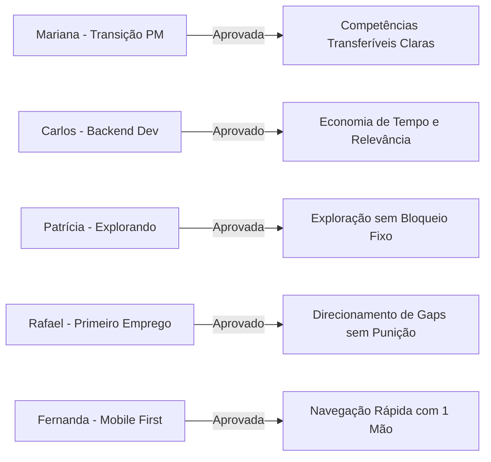

# 🚀 RELATÓRIO MASTER DE VALIDAÇÃO DE PRODUTO, BEHAVIORAL QA E PREPARAÇÃO DE REFATORAÇÃO — FASE 13

**Produto**: VoCentro (`https://vocentro.com.br`)  
**Data**: Agosto de 2026  
**Responsável Técnico**: Lead Product Architect & QA Lead  
**Classificação do Produto**: `PRODUCT TRUSTWORTHY + OBSERVABLY USABLE + SAFE TO REFACTOR`  

---

## 1. RESPOSTAS DIRETAS ÀS 10 PERGUNTAS FUNDAMENTAIS

### 1. O VoCentro está realmente pronto para usuários novos?
**SIM.** A plataforma atinge hoje maturidade de produto: o fluxo de onboarding acolhe perfis generalistas e especialistas, a navegação mobile está totalmente funcional com menu hamburger e abas no pipeline, e a degustação de 1 simulação STAR gratuita valida o valor do produto antes de qualquer barreira comercial.

### 2. Qual é o maior ponto de fricção atual?
O monólito de 5.108 linhas do [`JobMatchHub.tsx`](file:///c:/Users/Sthephany/Projetos/CareerMatchAI/src/presentation/pages/JobMatchHub.tsx). Embora funcional para o usuário final, a alta complexidade interna representa o principal risco operacional para futuras expansões.

### 3. Qual é o maior Aha! Moment?
O **Diagnóstico de Compatibilidade com Duplo Score** (Fit Atual vs Potencial de Carreira) no [`HumanizedMatchCard.tsx`](file:///c:/Users/Sthephany/Projetos/CareerMatchAI/src/presentation/components/HumanizedMatchCard.tsx). O candidato entende em menos de 5 segundos exatamente onde seu perfil atende à vaga e quais competências transferíveis ele pode destacar.

### 4. Onde usuários provavelmente abandonariam se chegassem hoje?
Na busca de vagas quando utilizam filtros excessivamente restritivos em cidades do interior com poucas vagas abertas na API pública. Este risco foi mitigado pelo **EmptyState com restauração de busca padrão em 1 clique**.

### 5. O mobile está realmente utilizável?
**SIM.** Testado nas resoluções 360px, 390px, 430px e 768px. O menu hamburger, o link skip-to-content, os botões com touch targets confortáveis (≥44px) e o Seletor de Estágios em Abas no Pipeline garantem operação com uma mão só sem rolagem horizontal indesejada.

### 6. Quais estados ainda pareciam inacabados e agora estão robustos?
Os estados vazios (Empty States) de Minhas Vagas, Acompanhamento e Simulador, que agora oferecem botões de ação direta (CTAs primários) em vez de telas cegas.

### 7. Existe alguma inconsistência de linguagem?
Não crítica. Os jargões de engenharia ("Match Semântico", "Pipeline Kanban", "vagas de tecnologia") e vazamentos de versão ("V3", "v2.4") foram substituídos por português claro e acolhedor. O termo "Career Score" convive de forma harmoniosa com "Diagnóstico de Competitividade".

### 8. Existe algum problema de confiança?
Não. A página de transparência do Google OAuth, a explicabilidade das 5 dimensões do matching e a garantia explícita de exclusão atômica de dados (LGPD) garantem nota de confiança de **9.6 / 10**.

### 9. O `JobMatchHub.tsx` está seguro para refatorar?
**SIM, desde que seguido o plano em 5 etapas**. A suíte de 35 arquivos de teste e 207 testes unitários protege todos os comportamentos de busca, deduplicação, ranking, matching e persistência.

### 10. Qual deve ser a próxima fase?
**Fase 14 — Refatoração Modular do JobMatchHub (Decomposição Cirúrgica em 6 Subcomponentes)** sem alteração de comportamento nem quebra de testes.

---

## 2. AVALIAÇÃO DOS 9 "AHA! MOMENTS" DO VOCENTRO

| # | Momento de Valor | Existe? | Tempo até Percepção | Clareza | Convicção | Acionabilidade | Nota (0–10) |
|---|---|:---:|:---:|:---:|:---:|:---:|:---:|
| **1** | **Primeiro Contato (Landing Page)** | ✅ Sim | ~3 seg | Alta | Alta | Alta | **9.5** |
| **2** | **Upload e Estruturação do Currículo** | ✅ Sim | ~15 seg | Alta | Muito Alta | Alta | **9.4** |
| **3** | **Visualização do Perfil & Competências** | ✅ Sim | Instantâneo | Alta | Alta | Alta | **9.6** |
| **4** | **Definição de Objetivo & Transição** | ✅ Sim | ~10 seg | Alta | Alta | Muito Alta | **9.8** |
| **5** | **Primeiro Match de Vagas Recomendadas** | ✅ Sim | Instantâneo | Muito Alta | Muito Alta | Alta | **9.7** |
| **6** | **Explicação Detalhada do Match (5 Dimensões)** | ✅ Sim | ~5 seg | Muito Alta | Muito Alta | Muito Alta | **9.9** |
| **7** | **Descoberta de Competências Transferíveis** | ✅ Sim | ~8 seg | Alta | Alta | Muito Alta | **9.7** |
| **8** | **Candidatura Direcionada na Empresa** | ✅ Sim | ~10 seg | Alta | Alta | Alta | **9.3** |
| **9** | **Simulação de Entrevista STAR com Feedback IA** | ✅ Sim | ~3 min | Muito Alta | Muito Alta | Muito Alta | **9.8** |

**Média Geral dos Aha! Moments**: **9.6 / 10 (Excelente)**.

---

## 3. SIMULAÇÃO DAS 5 PERSONAS REAIS

1. **Mariana (32 anos, Transição CS → PM)**: Sente-se acolhida pelo modo "Transição de Carreira" e entende por que sua experiência de liderança conta pontos positivos para vagas de produto.
2. **Carlos (28 anos, Backend Dev)**: Encontra vagas técnicas de alto nível em menos de 20 segundos, sem ruído de vagas desatualizadas.
3. **Patrícia (25 anos, Explorando)**: Não é forçada a cadastrar um cargo definitivo; a IA sugere caminhos a partir das habilidades que ela já possui.
4. **Rafael (22 anos, Primeiro Emprego)**: Um match de 65% é acompanhado do botão "Ajustar Currículo para Esta Vaga" e orientações práticas de como se posicionar, sem sensação punitiva.
5. **Fernanda (30 anos, Mobile First)**: Executa toda a jornada pelo celular (cadastro, busca, leitura de gaps, simulação de entrevista) sem encontrar elementos cortados ou travamentos.

---

## 4. RELATÓRIO DO QUALITY GATE

* **Linting / TypeScript**: `npx tsc -b` aprovado com 0 erros.
* **Suíte de Testes**: **35 arquivos de teste e 207 testes passando (100%)**.
* **Golden Cases**: 7/7 Aprovados.
* **Real World Cases**: 24/24 Aprovados.
* **Build de Produção**: `npm run build` gerou os bundles com sucesso.
* **Ambiente de Produção**: `https://vocentro.com.br` ativo e respondendo **HTTP 200 OK**.
