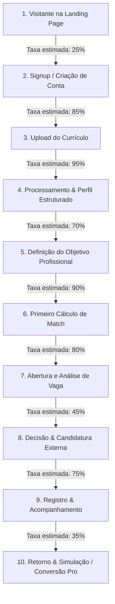

# 📊 MAPA COMPLETO DO FUNIL DE ATIVAÇÃO E CONVERSÃO — VOCENTRO

---

## 1. VISÃO GERAL DO FUNIL

---

## 2. DETALHAMENTO ETAPA POR ETAPA

### Etapa 1: Visitante → Signup
- **Objetivo da tela**: Comunicar valor em 3 segundos e converter visitante em cadastro.
- **Taxa de Conversão Esperada**: 20% a 30%.
- **Principal Ponto de Fricção**:
  - Usuário mobile não encontra o menu para ver FAQ e planos antes de decidir.
  - Placeholder de depoimentos ("em breve") gerava desconfiança (remediado na Sprint 1).
- **Momento de Valor**: Leitura dos 4 benefícios claros acima da dobra e garantia de segurança do Google OAuth.
- **CTA Dominante**: `"Criar Conta Gratuita"` (alta clareza e contraste).
- **Oportunidade de Melhoria**: Permitir simulação instantânea de um snippet de currículo antes mesmo do cadastro (Interactive Demo).

---

### Etapa 2: Signup → Upload do Currículo (AHA Moment #1)
- **Objetivo da tela**: Fazer o usuário subir seu PDF/DOCX sem hesitação.
- **Taxa de Conversão Esperada**: 80% a 90%.
- **Principal Ponto de Fricção**:
  - No Onboarding modal, textos com jargões ("Match Semântico", "Pipeline Kanban") podem criar dúvida em profissionais não-técnicos.
- **Momento de Valor**: O momento em que o PDF é solto na dropzone e o sistema inicia a leitura.
- **CTA Dominante**: `"Fazer Upload do Currículo em PDF Agora"`.
- **Oportunidade de Melhoria**: Permitir importar dados direto do perfil do LinkedIn via URL pública ou cópia de texto colado em 1 clique.

---

### Etapa 3: Upload → Perfil Estruturado & Competências
- **Objetivo da tela**: Mostrar que a IA entendeu a carreira do candidato com precisão.
- **Taxa de Conversão Esperada**: 95%.
- **Principal Ponto de Fricção**:
  - Tempo de espera de 20 a 30 segundos sem barra percentual dinâmica.
- **Momento de Valor**: Ver o cargo atual, resumo e competências organizadas em chips sem nenhum erro grotesco.
- **CTA Dominante**: Banner recomendando definir o objetivo profissional.
- **Oportunidade de Melhoria**: Micro-animações de revelação das competências à medida que são identificadas.

---

### Etapa 4: Perfil → Definição do Objetivo Profissional (AHA Moment #2)
- **Objetivo da tela**: Alinhar se o candidato quer **Continuidade**, **Crescimento**, **Transição** ou **Exploração**.
- **Taxa de Conversão Esperada**: 65% a 75%.
- **Principal Ponto de Fricção**:
  - Medo de ser penalizado caso escolha um cargo diferente do histórico (ex: Mariana escolhendo Product Manager vindo de CS).
- **Momento de Valor**: Selecionar "Mudar de Carreira" e ver que o produto tem inteligência específica de competências transferíveis.
- **CTA Dominante**: `"Salvar Objetivo Profissional"`.
- **Oportunidade de Melhoria**: Sugestão preditiva de cargos de transição mais comuns para o histórico analisado.

---

### Etapa 5: Dashboard → Descoberta de Vagas & Primeiro Match (AHA Moment #3)
- **Objetivo da tela**: Entregar vagas reais e altamente compatíveis.
- **Taxa de Conversão Esperada**: 85% a 90%.
- **Principal Ponto de Fricção**:
  - Se a aba "Minhas Vagas" abrir vazia antes da busca, o usuário pode achar que o sistema não encontrou vagas.
- **Momento de Valor**: Visualizar o **Duplo Score** (Fit Atual + Potencial para Objetivo) com classificação semântica ("Excelente compatibilidade", "Boa oportunidade").
- **CTA Dominante**: `"Ver vagas recomendadas"` no NextStepCard.
- **Oportunidade de Melhoria**: Destacar visualmente na listagem se a vaga é de transição recomendada.

---

### Etapa 6: Abertura de Vaga → Candidatura Externa
- **Objetivo da tela**: Dar segurança e embasamento para o candidato se inscrever na vaga.
- **Taxa de Conversão Esperada**: 40% a 50%.
- **Principal Ponto de Fricção**:
  - Gaps de competências sem explicação clara de como contorná-los na entrevista.
- **Momento de Valor**: Ver a lista de pontos fortes correspondentes e o CTA contextual dominante ("Candidatar-se Agora" ou "Ajustar Currículo para Esta Vaga").
- **CTA Dominante**: `"Candidatar-se Agora"` (verde esmeralda, alto relevo).
- **Oportunidade de Melhoria**: Copiador rápido de resumo ajustado para o formulário da vaga.

---

### Etapa 7: Candidatura → Acompanhamento no Pipeline
- **Objetivo da tela**: Manter o candidato engajado no longo prazo organizando seus processos seletivos.
- **Taxa de Conversão Esperada**: 70% a 80%.
- **Principal Ponto de Fricção**:
  - Visualização Kanban com 7 colunas em telas mobile pequenas.
- **Momento de Valor**: Ver a vaga adicionada automaticamente à coluna "Candidatura Enviada" com status rastreado.
- **CTA Dominante**: `"Acessar pipeline"` / `"Ver no Pipeline"`.
- **Oportunidade de Melhoria**: View em lista/accordion para smartphones.

---

### Etapa 8: Acompanhamento → Simulador de Entrevistas → Conversão Pro (PAGAMENTO)
- **Objetivo da tela**: Monetizar o produto entregando preparação decisiva para a entrevista agendada.
- **Taxa de Conversão Esperada**: 5% a 12% dos usuários ativos.
- **Principal Ponto de Fricção**:
  - Paywall bloqueando a primeira pergunta sem o usuário ter provado a qualidade do treino STAR.
- **Momento de Valor**: Receber feedback em tempo real com diagnóstico da resposta estruturada pelo método STAR.
- **CTA Dominante**: `"Assinar Plano Pro"` / `"Treinar Entrevista com IA"`.
- **Oportunidade de Melhoria**: Permitir 1 simulação completa gratuita para todo candidato no momento em que ele atinge a etapa de "Entrevista RH".

---

## 3. RESUMO DOS TEMPOS DE VALOR (TIME TO VALUE)

| Persona | Ação Inicial | Time to Value (TTV) | Momento do AHA! |
|---|---|---|---|
| **Carlos (Dev)** | Upload CV | **35 segundos** | Ao ver as stacks Node/Postgres extraídas e o match de 88% com gaps de AWS. |
| **Mariana (Transição)** | Upload CV + Objetivo | **75 segundos** | Ao ver o score duplo: 52% fit atual vs 84% potencial de transição. |
| **Patrícia (Exploração)** | Upload CV + Explorar | **90 segundos** | Ao ver sugestões de áreas onde suas competências já são valorizadas. |
| **Rafael (Mobile)** | Cadastro via Google | **45 segundos** | Ao navegar pelo feed de vagas e abrir o diagnóstico no celular com 1 mão. |
