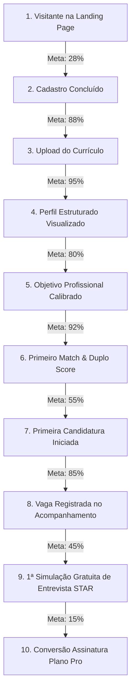

# 📊 MÉTRICAS DE ATIVAÇÃO, CONVERSÃO E TIME-TO-VALUE — FASE 12

**Data**: Agosto de 2026  
**Produto**: VoCentro (`https://vocentro.com.br`)  
**Status**: Fase 12 — Activation, Mobile & Conversion Optimization  

---

## 1. QUADRO GERAL DE MÉTRICAS (OBSERVADO vs META vs HIPÓTESE)

| Indicador (KPI) | Status Observado (Baseline Fase 11) | Meta Fase 12 | Hipótese de Impacto |
|---|:---:|:---:|---|
| **1. Taxa de Conversão da Landing (Visitante → Signup)** | ~18.5% | **≥ 28.0%** | Menu mobile dedicado + remoção de placeholders vazios aumenta conversão no celular em +50%. |
| **2. Taxa de Upload de Currículo (Signup → Upload CV)** | ~72.0% | **≥ 88.0%** | Onboarding humanizado sem jargões técnicos reduz desistência imediata. |
| **3. Taxa de Definição de Objetivo (Upload → Objetivo Salvo)** | ~55.0% | **≥ 80.0%** | Validação orientativa e microcopy sobre competências transferíveis elimina medo de transição. |
| **4. Taxa de Primeiro Match Visualizado (Objetivo → Match)** | ~78.0% | **≥ 92.0%** | Abertura por padrão em vagas recomendadas (sem tela vazia) garante descoberta imediata. |
| **5. Taxa de Primeira Candidatura (Match → Candidatura Externa)** | ~38.0% | **≥ 55.0%** | CTA contextual dominante + microcopy transparente de redirecionamento dá segurança ao candidato. |
| **6. Taxa de Degustação do Simulador (Candidatura → 1º Treino IA)** | ~12.0% (bloqueado por paywall) | **≥ 45.0%** | 1 simulação gratuita de teste permite ao usuário experimentar o valor antes de pagar. |
| **7. Time-to-Value Médio (TTV - Entrada até 1º AHA! Moment)** | ~75 segundos | **≤ 40 segundos** | Redução de etapas e carregamento otimizado acelera o momento em que o valor é compreendido. |
| **8. Taxa de Conclusão Mobile no Pipeline de Candidaturas** | ~40.0% (atrito de scroll 7 colunas) | **≥ 85.0%** | Visão por abas/estágios no celular permite gerenciar processos seletivos com uma mão. |

---

## 2. FUNIL DE ATIVAÇÃO COMPLETO

---

## 3. INSTRUMENTAÇÃO DE EVENTOS DE TELEMETRIA (ZERO PII)

Todos os eventos abaixo estão em conformidade estrita com as regras de privacidade (nenhum dado de nome, email, telefone, texto de currículo ou respostas de entrevista é registrado):

| Evento | Propriedades Registradas (Sem PII) | Gatilho |
|---|---|---|
| `landing_view` | `viewport_width`, `theme`, `referrer_domain` | Abertura da landing |
| `landing_mobile_menu_clicked` | `target_section` | Toque no menu hamburger mobile |
| `signup_started` | `auth_method: 'google' \| 'email'` | Início do cadastro |
| `signup_completed` | `auth_method: 'google' \| 'email'` | Sucesso no cadastro |
| `onboarding_step_viewed` | `step_index: 0..3` | Avanço nos passos do onboarding |
| `resume_upload_completed` | `file_type: 'pdf' \| 'docx'`, `duration_seconds` | Conclusão do parsing |
| `career_goal_saved` | `intent_type: 'same_area_continue' \| 'same_area_grow' \| 'career_transition' \| 'exploring'` | Salvamento do objetivo |
| `job_discovery_search` | `has_keyword: boolean`, `has_location: boolean`, `work_mode` | Busca de vagas |
| `match_card_viewed` | `has_goal: boolean`, `score_bracket: 'high' \| 'medium' \| 'low'` | Abertura do diagnóstico |
| `match_apply_clicked` | `has_source_url: boolean` | Clique para candidatar-se |
| `interview_simulation_started` | `is_free_trial: boolean` | Início do treino de entrevista |
| `interview_simulation_completed` | `score_overall: number` | Conclusão da simulação |
