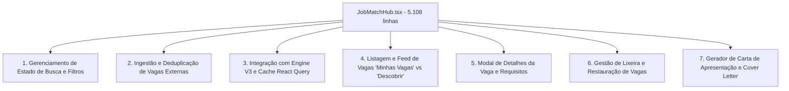

# 🏗️ PLANO DE DECOMPOSIÇÃO E REFATORAÇÃO ARQUITETURAL: `JobMatchHub.tsx`

**Arquivo Alvo**: [`src/presentation/pages/JobMatchHub.tsx`](file:///c:/Users/Sthephany/Projetos/CareerMatchAI/src/presentation/pages/JobMatchHub.tsx)  
**Tamanho Atual**: 5.108 linhas (285 KB)  
**Complexidade Ciclomática**: Alta  
**Status**: `REFACTORING PLAN — EXECUÇÃO ISOLADA POSTERIOR` (Sem big-bang na Fase 12 para garantir zero regressões no motor e na experiência)  

---

## 1. DIAGNÓSTICO DE RESPONSABILIDADES ATUAIS

O `JobMatchHub.tsx` atualmente acumula 7 responsabilidades distintas em um único arquivo:

---

## 2. MAPA DE SUBCOMPONENTES PROPOSTO

A refatoração modular decomporá o monólito em 6 componentes desacoplados, mantendo o `JobMatchHub.tsx` apenas como orquestrador limpo de ~350 linhas:

| Subcomponente Proposto | Responsabilidade | Linhas Estimadas |
|---|---|:---:|
| `JobSearchFilterBar.tsx` | Barra de busca rápida, filtros de cidade, modalidade, senioridade e data de publicação. | ~350 linhas |
| `JobFeedList.tsx` | Renderização do feed de vagas com paginação virtualizada, ordenação por afinidade e empty states acionáveis. | ~450 linhas |
| `JobDetailModal.tsx` | Visualização detalhada dos requisitos da vaga, benefícios, salário e link oficial de candidatura. | ~400 linhas |
| `JobTrashDrawer.tsx` | Painel gaveta de vagas descartadas com ações de restauração individual e limpeza permanente. | ~300 linhas |
| `CoverLetterGeneratorModal.tsx` | Gerador inteligente de carta de apresentação e resumo para o recrutador. | ~350 linhas |
| `useJobMatchHubState.ts` (Hook) | Centralização dos estados de busca, paginação, filtros e sincronização com React Query. | ~400 linhas |

---

## 3. MATRIZ DE RISCOS E MITIGAÇÕES

| Risco Identificado | Severidade | Estratégia de Mitigação |
|---|:---:|---|
| **1. Regressão na Deduplicação e Ranking V3** | **Crítico** | Manter o `RankingEngineService` e `UnifiedMatchService` intactos. O hook apenas consumirá os serviços existentes. |
| **2. Perda de Estado de Filtro na Navegação** | **Médio** | Persistir filtros no estado do React Query com chave `['job_filters', userId]`. |
| **3. Quebra de Testes Unitários Existentes** | **Alto** | Executar a suíte de 34 arquivos / 203 testes a cada subcomponente extraído. |
| **4. Inconsistência de Tema Claro/Escuro** | **Baixo** | Utilizar exclusivamente tokens do Tailwind / Design System (`bg-card`, `border-border`, `text-foreground`). |

---

## 4. ESTRATÉGIA DE MIGRAÇÃO EM 4 PASSOS (PARA A FASE 13)

1. **Passo 1 — Extrair Hook de Estado**: Criar `useJobMatchHubState.ts` com testes unitários isolados para filtros e paginação.
2. **Passo 2 — Extrair Modais Secundários**: Isolar `JobTrashDrawer.tsx` e `CoverLetterGeneratorModal.tsx` sem alterar o feed principal.
3. **Passo 3 — Isolar `JobSearchFilterBar.tsx`**: Desacoplar os controles de filtro e busca.
4. **Passo 4 — Isolar `JobFeedList.tsx`**: Finalizar a extração da listagem de cards, reduzindo o `JobMatchHub.tsx` para um container declarativo.
