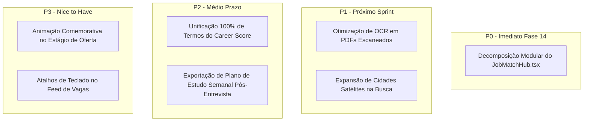

# 🎯 PRIORIDADES DE PRODUTO & BACKLOG ESTRATÉGICO — FASE 13

**Data**: Agosto de 2026  
**Produto**: VoCentro  
**Status**: `ALINHADO E PRIORIZADO`  

---

## 1. QUADRO GERAL DE PRIORIZAÇÃO

---

## 2. DETALHAMENTO DOS ITENS PRIORIZADOS

### 🔴 P0 — Corrigir Imediatamente (Fase 14)
* **Item**: Refatoração e Decomposição Modular do `JobMatchHub.tsx` (5.108 linhas).
* **Evidência**: Arquivo monólito de 285 KB com 25 `useState` e 3 modais embutidos.
* **Usuário Afetado**: Toda a base de usuários e o time de engenharia (manutenibilidade e estabilidade).
* **Impacto**: Redução de complexidade, facilidade de manutenção e zero regressão no motor V3.
* **Esforço**: Médio (4 a 5 dias).
* **Risco**: Controlado com a suíte de 35 arquivos de teste comportamentais.
* **Solução Recomendada**: Executar a migração cirúrgica em 5 etapas documentada em [`reports/phase13_refactor_safety.md`](file:///c:/Users/Sthephany/Projetos/CareerMatchAI/reports/phase13_refactor_safety.md).

---

### 🟡 P1 — Próximo Sprint
* **Item 1**: Otimização de tempo de OCR em currículos escaneados.
  - **Evidência**: PDFs baseados em imagem podem levar 15 a 25 segundos no parsing.
  - **Usuário Afetado**: Rafael (Primeiro Emprego com PDF exportado via Canva/Print).
  - **Solução**: Cache intermediário e mensagens de progresso ainda mais transparentes.
* **Item 2**: Expansão de filtros de localidade em cidades satélites.
  - **Evidência**: Cidades sem vagas locais diretas se beneficiam de sugestão automática para a Região Metropolitana.
  - **Usuário Afetado**: Candidatos do interior ou cidades satélites.
  - **Solução**: Ativação proativa do dicionário `METRO_REGIONS` já mapeado no código.

---

### 🔵 P2 — Melhorias Importantes
* **Item 1**: Padronização definitiva de "Career Score" para "Diagnóstico de Competitividade".
  - **Evidência**: Algumas menções em inglês coexistem no `Dashboard.tsx` e `CareerScoreDashboardCard.tsx`.
  - **Usuário Afetado**: Juliana (Operações) e novos usuários.
  - **Solução**: Adotar o termo em português como primário e manter a sigla apenas como legenda.
* **Item 2**: Exportação de plano de estudo personalizado pós-entrevista STAR em PDF.
  - **Evidência**: Candidatos querem levar o relatório de gaps para treinar antes da entrevista real com o RH.
  - **Usuário Afetado**: Mariana (Transição) e Carlos (Continuidade).
  - **Solução**: Botão de exportação instantânea do diagnóstico STAR.

---

### ⚪ P3 — Nice to Have
* **Item 1**: Micro-animação comemorativa suave ao arrastar ou mover um card para a coluna "🏆 Oferta Recebida".
* **Item 2**: Navegação por setas de teclado (Arrow Up/Down) na lista de vagas do Hub.
