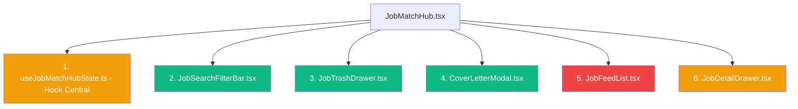

# 🛡️ ANÁLISE DE SEGURANÇA E MATRIZ DE RISCO PARA REFATORAÇÃO DO `JobMatchHub.tsx`

**Arquivo Alvo**: [`src/presentation/pages/JobMatchHub.tsx`](file:///c:/Users/Sthephany/Projetos/CareerMatchAI/src/presentation/pages/JobMatchHub.tsx)  
**Dimensão**: 5.108 linhas (285 KB)  
**Fase de Execução Recomendada**: `Fase 14 (Refatoração Modular Dedicada)`  

---

## 1. MATRIZ DE RISCO POR MÓDULO CANDIDATO

| Módulo Candidato | Classificação de Risco | Linhas Estimadas | Dependências e Estados Compartilhados |
|---|:---:|:---:|---|
| **1. `JobTrashDrawer.tsx`** | 🟢 **SAFE** | ~280 | Consome apenas `useJobTrash` (`trashedJobs`, `restoreFromTrash`, `clearTrash`). Desacoplado do feed principal. |
| **2. `CoverLetterModal.tsx`** | 🟢 **SAFE** | ~320 | Depende apenas da vaga selecionada e do perfil para gerar a carta em PDF via `printElementHtml`. |
| **3. `JobSearchFilterBar.tsx`** | 🟢 **SAFE** | ~340 | Controla inputs de busca, dropdown de cidades e modalidade. Dispara callback `onSearch`. |
| **4. `useJobMatchHubState.ts`** | 🟡 **MODERATE RISK** | ~400 | Centraliza sincronização com React Query, paginação e controle de visualizações. Exige testes de estado prévios. |
| **5. `JobDetailDrawer.tsx`** | 🟡 **MODERATE RISK** | ~450 | Exibe o `HumanizedMatchCard`, radar chart e requisitos da vaga selecionada. |
| **6. `JobFeedList.tsx`** | 🔴 **HIGH RISK** | ~500 | Ponto de maior risco: consome `RankingEngineService`, `isJobUnlocked` e atualizações otimistas de match. |

---

## 2. REQUISITOS OBRIGATÓRIOS ANTES DA REFATORAÇÃO

1. **NÃO iniciar refatoração em big-bang**: Cada componente deve ser extraído em pull request / commit isolado com verificação imediata de testes.
2. **Preservação Inviolável do Engine**: O `CareerMatchEngineV3`, `MATCHING_WEIGHTS` e as fórmulas de cálculo determinístico NÃO podem ser tocados.
3. **Execução Contínua da Suíte de Testes**: Os 35 arquivos de teste e 207 testes unitários devem ser executados e aprovados a cada módulo extraído.

---

## 3. ORDEM DE MIGRAÇÃO OPERACIONAL EM 5 ETAPAS

1. **Etapa 1 (🟢 Risco Mínimo)**: Extrair `JobTrashDrawer.tsx` e `CoverLetterModal.tsx`.
2. **Etapa 2 (🟢 Risco Baixo)**: Extrair `JobSearchFilterBar.tsx` com testes de digitação e seleção de localidade.
3. **Etapa 3 (🟡 Risco Médio)**: Extrair `JobDetailDrawer.tsx` mantendo a interface de props intacta.
4. **Etapa 4 (🟡 Risco Médio)**: Criar o hook customizado `useJobMatchHubState.ts` para isolar os 25 `useState`.
5. **Etapa 5 (🔴 Risco Alto)**: Isolar `JobFeedList.tsx` e transformar o `JobMatchHub.tsx` em um orquestrador limpo de ~350 linhas.
